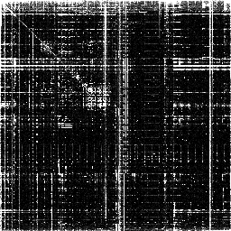
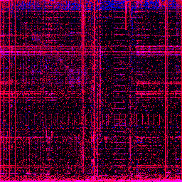

# Binviz

A command line tool that allows you to inspect different binary formats.

## Overview / Quickstart

```txt
Usage: binviz.exe <COMMAND>

Commands:
  entropy    Calculate the n-dimensional entropy of a given file, for n in 1..=count, in bits per `n` bytes
  frequency  Get the bytes in sorted order according to their frequency of a given file
  visualize  Visualize the given file as an image (digraph analysis)
  full       Perform a full analysis, by performing all other commands on every file and collecting the output into folders corresponding to each file
  help       Print this message or the help of the given subcommand(s)

Options:
  -h, --help  Print help
```

## Examples - Visualization

### Executables (.exe)

This is the release binary of my other project [Spotify Stats](https://github.com/BroodjeKroepoek/Spotify-Stats) visualized, using digraph analysis:


<!--  -->

This is the same binary visualized, but now using the new trigraph analysis, introduced in [v0.9.1](https://github.com/BroodjeKroepoek/Binviz/releases/tag/v0.9.1):


<!--  -->

### Images (.png)

TBD

## Text Data (.txt, .json, ...)

TBD
